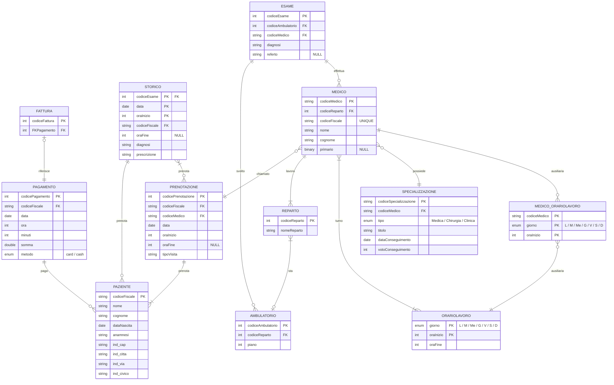

# Progetto Applicazione Web

## Introduzione del Progetto
Il progetto prevede la realizzazione di un'applicazione web completa, sviluppata progressivamente attraverso diverse fasi. Ogni fase si concentra su un aspetto specifico dello sviluppo, costruendo gradualmente un sistema funzionante e professionale.

La  ***prima fase*** comprende:

1. **Analisi** dei requisiti
2. **Diagramma E-R** realizzato con Mermaid
3. **Schema logico**
4. **DDL**
5. **Dizionario** dei dati
6. **Cocnlusioni**
7. **Relazione tecnica** finale del progetto realizzata in markdown

## Analisi dei Requisiti
Il sistema prevede un database per la gestione di un centro polispecialistico. Fornirà la digitalizzazione dei dati dei pazienti (anagrafici e clinici), la gestione dei medici con le rispettive specializzazioni e gli orari di lavoro, le prenotazioni e la conservazione storica degli esami diagnostici. Sono inoltre previste funzionalità per l’assegnazione delle sale ambulatoriali nei diversi reparti e per la gestione dei pagamenti e della fatturazione.

---

<div style="page-break-after: always"></div>

## Diagramma Entità-Relazione (E-R)
<!-- ||--o // }|--o -->



---

<div style="page-break-after: always"></div>   

## Schema Logico Relazionale
**PAGAMENTO** (#<u>codicePagamento</u>, codiceFiscale, data, ora, minuti, somma, metodo)

**FATTURA** (#<u>codiceFattura</u>, codicePagamento)

**PAZIENTE** (#<u>codiceFiscale</u>, nome, cognome, dataNascita, anamnesi, ind_cap, ind_citta, ind_via, ind_civico)

**STORICO** (#<u>codiceEsame</u>, #<u>data</u>, #<u>oraInizio</u>, codiceFiscale, oraFine*, diagnosi, prescrizione)

**PRENOTAZIONE** (#<u>codicePrenotazione</u>, codiceFiscale, codiceMedico, data, oraInizio, oraFine*, tipoVisita)

**MEDICO** (#<u>codiceMedico</u>, codiceReparto, orario, codiceFiscale (UNIQUE), nome, cognome, primario*)

**REPARTO** (#<u>codiceReparto</u>, nomeReparto)

**AMBULATORIO** (#<u>codiceAmbulatorio</u>, codiceReparto, piano)

**ESAME** (#<u>codiceEsame</u>, codiceAmbulatorio, codiceMedico, diagnosi, referto*)

**ORARIOLAVORO** (#<u>giorno</u>, #<u>oraInizio</u>, oraFine)

**SPECIALIZZAZIONE** (#<u>codiceSpecializzazione</u>, codiceMedico, tipo, titolo, dataConseguimento, votoConseguimento)

**MEDICO_ORARIOLAVORO** (#<u>codiceMedico</u>, #<u>giorno</u>, #<u>oraInizio</u>)

---

<div style="page-break-after: always"></div>   

## DDL (Data Definition Language)
Il **DDL** è l'insieme di comandi <u>SQL</u> (Structured Query Language) utilizzati per definire, creare e modificare la struttura di un Database. Grazie ad esso è possibile creare tabelle, record, attributi e relazioni tra entità specificandone le Primary Key e le Foreign Key per garantire l'integrità dei dati. Inoltre, permette di applicare vincoli Intra-Relazionali e Inter-Relazionali in modo da mantenere il Database coerente e affidabile.

_Di seguito le porzioni di codice salienti con le relative spiegazioni._

### Ruolo delle Chiavi Primarie
```
Come detto in precedenza, le Chiavi Primarie (o Primary Key), serovno per mantenere l'integrità dei dati e l'univocità dei vari record all'interno di una tabella.
```

_Esempio:_
```sql
    CREATE TABLE PAGAMENTO (
        codicePagamento INT PRIMARY KEY,
        ...
    )
```
In questo caso, i record all'interno della tabella "PAGAMENTO" saranno identificati dal <u>"codicePagamento"</u>.

---

<div style="page-break-after: always"></div>

### Ruolo delle Chiavi Esterne
```
Al contrario delle chiavi primarie, le Chiavi Esterne (o Foreign Key) hanno la funzione di creare una relazione tra 2 entità.
```

_Esempio:_
```sql
    CREATE TABLE PAGAMENTO (
        CREATE TABLE PAGAMENTO (
            ...
            codiceFiscale VARCHAR(16),
            FOREIGN KEY (codiceFiscale) REFERENCES PAZIENTE(codiceFiscale),
            ...
    )
```
Nell'esempio riportato, l'attributo <u>"codiceFiscale"</u> è una chiave esterna che fa riferimento alla chiave primaria della tabella "PAZIENTE", consentendo di associare ogni record di "PAGAMENTO" a un paziente esistente e garantendo così il **vincolo di integrità referenziale**.

---

### Gestione dei Vincoli nel Database
Un **vincolo** in un Databse è una regola applicata ai dati che ha lo scopo di garantire la correttezza, la coerenza e l'affidabilità delle informazioni contenute nella base di dati. Queste regole limitano i valori che possono essere inseriti o modificati all'interno delle tabelle, impedendo quelle operazioni che violerebbero le funzionalità o la struttura del Database.

Vi sono varie tipologie di vincoli, di seguito vengono elencati i più importanti.

---

#### Vincolo di Dominio
```
Il vincolo di dominio permette di stabilire dei limiti per quanto riguarda un certo attributo all'interno di un record.
```

_Esempio:_
```sql
    ...
    CONSTRAINT check_ora CHECK(ora BETWEEN 0 AND 23)
    ...
```
Questa riga di codice limita il valore dell'attributo <u>"ora"</u> nell'intervallo tra 0 e 23.

---

#### Vincolo di Integrità Referenziale
```
Il vincolo di integrità referenziale permette di verificare l'esistenza di una refernza di una chiave esterna di un record ad una chiave primaria di un altro record appartenente ad un'altra tabella. 
```
_Esempio:_
```sql
...
    CONSTRAINT check_FKPaziente FOREIGN KEY(codiceFiscale)
        REFERENCES PAZIENTE(codiceFiscale)
        ON DELETE CASCADE
        ON UPDATE CASCADE
    ...
```
Il vincolo di integrità in questione stabilisce se vi è una vera relazione tra le FK dei record della tabella "PAGAMENTO" e le PK dei record nella tabella "PAZIENTI". Nel caso in cui il vincolo non sia rispettato, si può gestire l'errore in due metodi differenti:

1. Utilizzo de **CASCADE** -> <u>propagazione automatica dell'eliminazione o modifica delle tabelle</u> referenziate / referenzianti garantendone la coerenza e l'integrità

2. Utilizzo de **RESTRICT** -> <u>impedimento dell'eliminazione o della modifica</u> di un record nella tabella referenziante nel caso in cui esistano dei record correlati nelle tabelle referenziate, preservandone l'integrità

---

<div style="page-break-after: always"></div>   

## Dizionario dei Dati
**FATTURA**

\begin{itemize}
\item codiceFattura	INT	- Identificativo univoco della fattura
\item codicePagamento INT - Pagamento a cui la fattura si riferisce
\end{itemize}

**PAGAMENTO**

\begin{itemize}
\item codicePagamento INT - Identificatore univoco del pagamento
\item codiceFiscale	VARCHAR(16)	- Paziente che effettua il pagamento
\item data	DATE - Data del pagamento
\item ora INT - Ora del pagamento
\item minuti INT - Minuti del pagamento
\item somma	DOUBLE - Importo del pagamento
\item metodo VARCHAR(20) - Metodo di pagamento
\end{itemize}

**PAZIENTE**

\begin{itemize}
\item codiceFiscale	VARCHAR(16)	- Identificativo univoco del paziente
\item nome VARCHAR(50) - Nome del paziente
\item cognome VARCHAR(50) - Cognome del paziente
\item dataNascita DATE - Data di nascita del paziente
\item anamnesi TEXT - Informazioni cliniche pregresse del paziente
\item cap VARCHAR(10) - CAP dell’indirizzo di residenza
\item citta VARCHAR(50) - Città di residenza
\item via VARCHAR(50) - Via di residenza
\item civico VARCHAR(10) - Numero civico
\end{itemize}

**STORICO**

\begin{itemize}
\item codiceEsame INT - Esame svolto
\item data DATE - Data dell’esame
\item oraInizio INT - Ora di inizio
\item codiceFiscale VARCHAR(16) - Paziente coinvolto
\item oraFine INT - Ora di fine (opzionale)
\item diagnosi TEXT - Diagnosi medica
\item prescrizione TEXT - Prescrizione medica
\end{itemize}

**PRENOTAZIONE**

\begin{itemize}
\item codicePrenotazione INT - Identificativo univoco della prenotazione
\item codiceFiscale	VARCHAR(16)	- Paziente che prenota
\item codiceMedico VARCHAR(10) - Medico assegnato
\item data DATE	- Data della prenotazione
\item oraInizio	INT - Ora di inizio
\item oraFine INT - Ora di fine (opzionale)
\item tipoVisita VARCHAR(50) - Tipologia di visita
\end{itemize}

**MEDICO**

\begin{itemize}
\item codiceMedico VARCHAR(10) - Identificativo univoco del medico
\item codiceReparto INT - Reparto di appartenenza
\item codiceFiscale VARCHAR(16) - Codice fiscale del medico
\item nome VARCHAR(50) - Nome del medico
\item cognome VARCHAR(50) - Cognome del medico
\item primario BINARY - Indica se il medico è primario
\end{itemize}

**REPARTO**

\begin{itemize}
\item codiceReparto INT - Identificativo univoco del reparto
\item nomeReparto VARCHAR(50) - Nome del reparto
\end{itemize}

**AMBULATORIO**

\begin{itemize}
\item codiceAmbulatorio INT - Identificativo univoco dell’ambulatorio
\item codiceReparto INT - Reparto di appartenenza
\item piano INT - Piano dell’edificio
\end{itemize}

**ESAME**

\begin{itemize}
\item codiceEsame INT - Identificativo univoco dell’esame
\item codiceAmbulatorio	INT	- Ambulatorio in cui si svolge
\item codiceMedico VARCHAR(10) - Medico che effettua l’esame
\item diagnosi TEXT - Diagnosi dell’esame
\item referto TEXT - Referto medico (opzionale)
\end{itemize}

**ORARIOLAVORO**

\begin{itemize}
\item giorno VARCHAR(2) - Giorno della settimana
\item oraInizio INT - Ora di inizio turno
\item oraFine INT - Ora di fine turno
\end{itemize}

**SPECIALIZZAZIONE**

\begin{itemize}
\item codiceSpecializzazione VARCHAR(20) - Identificativo della specializzazione
\item codiceMedico VARCHAR(10) - Medico specializzato
\item tipo VARCHAR(30) - Tipo di specializzazione
\item titolo VARCHAR(50) - Titolo conseguito
\item dataConseguimento DATE - Data di conseguimento
\item votoConseguimento INT - Voto finale
\end{itemize}

**MEDICO_ORARIOLAVORO**

\begin{itemize}
\item codiceMedico VARCHAR(10) - Medico assegnato al turno
\item giorno VARCHAR(2) - Giorno del turno
\item oraInizio INT - Ora di inizio turno
\end{itemize}

---

<div style="page-break-after: always"></div>   

## Conclusione
Ho sviluppato il progetto in maniera più dettagliata possibile, definendo l'**architettura di un Database** per la <u>gestione di un centro polispecialistico</u>. Ho cominicato con l'analisi dei requisiti, dalla quale ho sviluppato uno **schema concettuale** e di conseguenza anche quello **logico**. Infine ho creato il **DDL** del sistema con il relativo **dizionario dei dati** che fornisce le informazioni fondamentali per l'interpretazione della progettazione.

Le mie <u>scelte progettuali</u> sono mirate all'integrità e alla coerenza dei dati, favorendo inoltre il fattore di **scalabilità** per limplementazione futura. Infatti, il modello relazionale che ho proposto consente la <u>gestione delle varie entità</u>, facilitandone il controllo e i <u>vincoli</u> all'interno del Database.

Come **sviluppi successivi** si propongono l'effettivo applicativo web e l'implementazione di un sistema di query adatte ad un carico reale di dati.